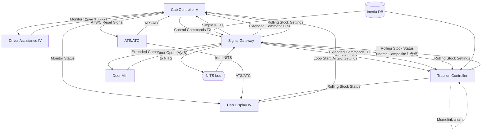

# CHUSO

中宗電鉄の各系列マイコンをまとめたディレクトリ。系列ごとに独立したプロジェクト
ディレクトリを持つ。

- `CHUSO1000_SAP_Cab_Controller/`
- `CHUSO1800_Traction_Controller/`・`CHUSO1800_Traction_Controller_LuaCore/`
- `CHUSO2000_Cab_Controller_V/`・`CHUSO2000_Cab_Display_IV/`・
  `CHUSO2000_Driver_Assistance_IV/`・`CHUSO2000_Traction_Controller/`・
  `CHUSO2000_Onecar_Control/`・`CHUSO2000_Door_Min/`・`CHUSO2000_Signal_Gateway/`

## ドキュメント

| ファイル | 役割 |
|---|---|
| [`SYSTEM_SPEC.md`](./SYSTEM_SPEC.md) | 2000系列システム全体の詳細仕様（正典）。全体データフロー、マイコン間インターフェース、各マイコン詳細、NITS通信プロトコル、制動・力行/ドア制御フロー |
| [`SignalComposite.md`](./SignalComposite.md) | 2000系列で使うコンポジット信号の全定義（正典）。チャンネル割付・負論理・NITSフレーム仕様 |

このREADMEの表と図は、上記2文書のうち関連性の把握に必要な部分だけを
要約したものである。チャンネル番号・負論理・ビット単位の仕様は必ず
上記2文書で確認すること。

## 2000系列の7マイコン

| マイコン | 役割 |
|---|---|
| **Cab Controller V** | 運転台制御の中核。マスコン・逆転器・ドア・標識灯・各種スイッチを集約し、制御コマンドと表示ステータスを生成 |
| **Cab Display IV** | 運転台モニタ表示。Monitor Status / Rolling Stock Status を映像化 |
| **Driver Assistance IV** | 運転支援。GPS+距離程から次駅・接近・停車・締切を判定 |
| **Traction Controller** | 牽引制御 (VVVF)。力行・回生・空気ブレーキ協調、パンタグラフ、高加速、Momelinkを管理 |
| **Onecar Control** | 単車制御。前後2運転台のControl Commands Type 3 (CC3)を合成。Simple IF前後反転 |
| **Door Min** | ドア最小制御。センサ間距離で開閉エリア判定、NITS指令で開扉、モータ速度とチャイムを出力 |
| **Signal Gateway** | NITS busとの出入口。CC3をSimple IF RX/Extended Commands RX/Rolling Stock Settingsへ変換し、`from NITS`/`to NITS`で編成内の他車と繋がる |

（`Signal Gateway`以外は`SYSTEM_SPEC.md`「1. システム概要」の表を要約。
`Signal Gateway`の役割は`project.json`の入出力ポート宣言のみを根拠にしており
（sw-net内部のロジックは未確認）、`SYSTEM_SPEC.md`本文には記載がない。各マイコン
の入出力ポート詳細は`SYSTEM_SPEC.md`「3. 各マイコン詳細」および各プロジェクトの
`SPEC.md`を参照）

## 2000系列マイコン間の関連

以下は2000系列マイコン間のコンポジット信号の概略図である。正典は
[`SYSTEM_SPEC.md`](./SYSTEM_SPEC.md)（特に「1.1 全体データフロー」「2. マイコン間
インターフェース」）と[`SignalComposite.md`](./SignalComposite.md)であり、この図は
関連性の見取り図に留める。チャンネル割付・負論理はここには示さない。

この図は**電気指令ブレーキ系統の標準構成**を示すものであり、系列番号で
対象範囲が決まるわけではない。電磁直通ブレーキ系統の図は未作成。

図中の見取りだけでは分かりにくい点を以下に補足する。

- **Onecar Control**は図から省いた。前位・後位2台のCab ControllerのControl
  Commands TXを1つのCC3へ合成し、Gatewayから戻ったSimple IF RXの前後を入れ替えて
  Traction Controllerへ渡す中継役だが、変換の中身を省きCab Controller VとSignal
  Gateway/Traction Controllerを直結する形で表した。合成・反転の詳細は
  `SYSTEM_SPEC.md`と`CHUSO2000_Onecar_Control/project.json`を参照。
- **CC3(≒Control Commands TX)とSimple IF RXは同じデータの往復であり、並存する
  2経路ではない。** Gateway→NITS bus→Gatewayを経て戻ってきた時点で名前が
  Simple IF RXに変わる。
- **Cab Display IV → Cab Controller V**の`Loop Start, ATS/C Settings`は、名前が
  Cab Controller Vの`Drive Loop`/`Settings Loop`入力と完全一致しない。対応関係は
  要確認。
- **Door Min**はCC3を直接受け取らない。開扉指令はGatewayの`Extended Commands RX`
  (Door_Minでの別名`NITS Ext. Input`)経由で受け、状態は`Door Open (A)/(B)`として
  Gatewayへ返す。project.json上の出力は`Door is Open`1系統のみで、Traction
  Controllerの自己ループ(M車/T車)と同様に扉グループA/Bで2台構成になっていると
  見られるが未確認。
- **Traction Controllerの自己ループ（Momelink, ID=1911）**は、異なるマイコン間
  ではなく同じTraction Controllerを積んだM車とT車の間を結ぶ専用線である。T車は
  ローカルに電動機計算を持たず、M車からMomelink経由で架線電圧・電流・空気
  ブレーキ分担（遅れ込め制御 ─ 電気制動の実際の効きに合わせて空気ブレーキ側の
  負担を配分する仕組み）を受け取る。詳細は[`SYSTEM_SPEC.md`](./SYSTEM_SPEC.md)
  §5「制動・力行制御フロー」を参照。
- **Inertia Composite**は車両内の別マイコンから供給されるため、図では
  データストア(円柱)として表した。Signal GatewayとTraction Controllerが独立に
  受け取る（Traction Controller側は`Inertia Composite Input`という別ポート名）。
  供給元マイコンは未確認。
- **ATS/ATC**はこの7マイコンに含まれない別マイコンで、Cab Controller V・
  Cab Display IVへ`ATS/ATC`信号を供給し、Cab Controller Vから`ATS/C Reset Signal`
  を受け取る。まだこのリポジトリに実体を持たないため、図では他と区別して示した。
