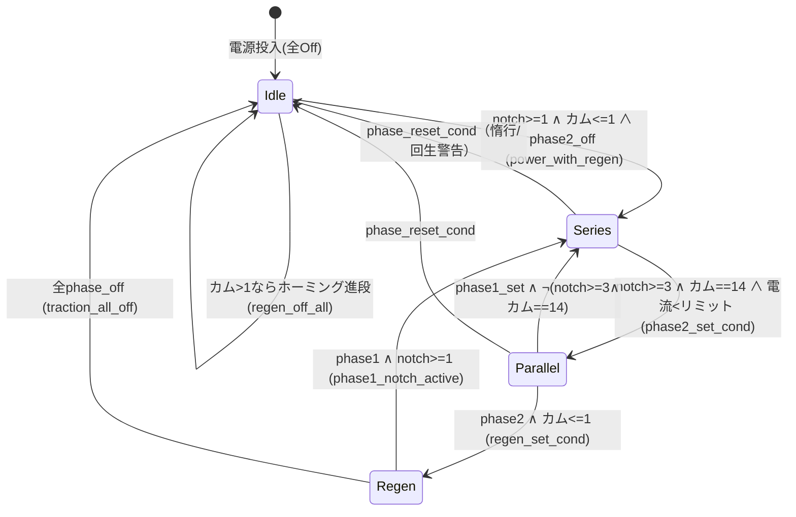

# CHUSO 1800 Traction Controller 詳細仕様・異常ステート分析

> - 対象: `CHUSO1800_Traction_Controller/main.sw-net` および `scripts/n409.lua`（sw-net 上の名称は `current_sim`）
> - 種別: 抵抗制御（直列・並列）＋回生制動を模擬する VVVF 風 牽引制御マイコン（1800 系）
> - 作成日: 2026-06-14
> - 本書は (1) ロジック構造の俯瞰、(2) **意図しない異常ステートへの突入可能性**の検討、(3) **冗長箇所**の抽出 を目的とする。

---

## 0. 凡例・解析モデル

### 0.1 表記
- sw-net の `inst` 行は `型ID 名前 (パラメータ): 入力 -> 出力` 形式。
- `THRESHOLD(min,max)` は **`min ≤ 入力 ≤ max` のとき On（true）** を返す論理ゲートとして扱う。
- `NUM_SWITCHBOX a,b,switch` は **`switch ? a : b`**（a=ON 値, b=OFF 値）。未接続入力は **0 / false**。
- `SR_LATCH` は **リセット優先**（set と reset が同時に真ならば出力 Off）。電源投入時は Off で初期化。
- `CAPACITOR(ct,dt)` は CHARGE 入力 On が `ct` 秒継続で On、Off で `dt` 秒かけて Off。本機では `dt=0`（即時 Off）の用法が多い。

### 0.2 ティック・ステップモデル（重要）
Stormworks のマイコンは **1 tick (1/60 s) ごとに全ゲートの出力を評価し、その出力が次 tick の入力となる**ステップ方式である。本解析では保守的に次を前提とする。

1. **すべてのゲート出力は 1 tick 遅延**を持つ（出力→次 tick 入力）。組合せ段が D 段あれば信号は D tick かけて伝搬する。
2. **フィードバックループ**（自己参照する FUNC、SR_LATCH、CAPACITOR、Lua、composite 再帰）は各 1 tick の状態レジスタとして矛盾なく定義される。
3. 異常ステートの多くは **「同一 tick で評価された set / reset の競合」** または **「帰還信号の 1 tick 遅れによる過渡的不整合」** から生じる。本書 §4 はこの観点で検討する。

### 0.3 storm-mcl 由来の表記注意（解析前提）
- 本機の `direction_nonzero` は sw-net 上 `THRESHOLD(min=0, max=1)` と出力されているが、**実機マイコンの値は `min=0, max=0`**（storm-mcl のシリアライズ不具合）。本書は **実機値 `(0,0)`** に基づき解析する（§3.5・§4.2）。
- `LUA` ノードの `script_ref="scripts/current_sim.lua"` は実ファイル `scripts/n409.lua` と不一致（§6）。
- `speed (channel=9)` は sw-net 上 composite 入力が省略されているが、**実機では Physics Sensor → ch9 が接続**されている前提（speed = 前後速度 [m/s]）。

---

## 1. モジュール概要

抵抗制御車（1800 系）の主回路を 1 マイコンで模擬・制御する。マスコン（ノッチ）指令を受け、**カム段（抵抗段）を自動進段**させながら電動機電流・トルク・電力を Lua で算出し、BC（ブレーキシリンダ）目標圧・電力・Momelink・状態表示を出力する。

主な制御モードは Lua（`n409.lua`）内の状態で表現される。

| モード | 駆動条件 | 抵抗器テーブル | 1 電動機電圧 Vt |
|---|---|---|---|
| **直列 (series)** | `phase1` ラッチ On | `SR[]` | `vl / 8` |
| **並列 (parallel)** | `phase2` ラッチ On | `PR[]` | `vl / 4` |
| **回生 (regen)** | `regen` ラッチ On | — | 界磁制御 |
| 惰行/無励磁 | phase1・phase2 とも Off | — | `vl = 0` |

### 1.1 入出力ポート

| 方向 | ポート | 型 | 用途 |
|---|---|---|---|
| in | Phyics Sensor [+Z is front] | composite | 速度（ch9）※ |
| in | Catenary Line Voltage [V] | number | 架線電圧実測 |
| in | SAP [atm] | number | 自動空気ブレーキ管圧 |
| in | BP [atm] | number | ブレーキ管圧 |
| in | BC [atm abs] | number | ブレーキシリンダ圧（絶対） |
| in | MR [atm abs] | number | 元空気だめ圧 |
| in | Controller Stop | boolean | 制御停止（→ EB 条件） |
| in | Simple IF | composite | ノッチ・方向・EB 等の指令 |
| in | Extended IF | composite | パンタ昇降・締切等 |
| in | Momelink inner unit | composite | 編成内ユニット情報 |
| out | W | number | 電力 [W] |
| out | BC target [atm] | number | BC 目標圧 |
| out | DANRYU | boolean | 断流（電流 ≤ 0） |
| out | cam | boolean | カム 1 巡完了パルス（カム接点表示と推定） |
| out | Momelink-A | composite | Momelink 送信 |
| out | Rolling Stock Status | composite | 表示用 車両状態 |

※ §0.3 参照。

---

## 2. 全体データフロー

```
 Simple IF ─┬─ notch_pos(ch2) ─▶ notch_eff ─┬─▶ notch_ge1..4
            ├─ eb_signal(ch18)               │
            ├─ fwd/bwd(ch16/17) ─▶ direction │
            └─ brake/sap(ch1) ─▶ ブレーキ圧   │
                                              ▼
 Catenary ─▶ catenary_voltage_sw ──┐   ┌─ phase1/phase2/regen 状態機械 ◀─┐
 cam step (position_counter) ──────┼──▶│  （直列/並列/回生 進段）         │
                                   │   └──────────────┬─────────────────┘
              sim_input(composite) │                  │ traction_status(bool)
                    ▼              ▼                  ▼
            ┌──────────────────────────────────────────────┐
            │  current_sim  (Lua / n409.lua)                │
            │   in : speed,Vl,cam,dir,notch,200,regenBC×2   │
            │   out: ch1 電流, ch2 逆起電力, ch3 加速度,      │
            │        ch4 電力W, ch5 カム段, ch6 界磁, ch7 bcT │
            └───────┬───────────────────────────────┬──────┘
                    │ (eb_condition で regen 書込みに切替)  │
       current_src_mux ◀── eb_condition ──────────────┘
                    │
   ┌────────────────┼─────────────────────────────────────┐
   ▼                ▼                ▼            ▼          ▼
 motor_current   notch_fb(ch5)   W(ch4)      bc_target   進段判定
 →DANRYU/保護    →状態機械        →出力W      →Momelink   (current_below_limit)
```

ポイント: **`current_src_mux` が帰還の要**。通常は Lua 出力（`current_sim_composite`）を、`eb_condition` 成立時は `regen_current_write`（ch7 のみ書込み）を電流源として選ぶ。後者では ch1/3/4/5/6 が 0 となり、状態機械を強制的に初期側へ崩す（§4.5）。

---

## 3. 機能ブロック詳細

### 3.1 架線電圧選択

```
Catenary [V] ─▶ catenary_active_thresh = THRESHOLD(0,1)   … V∈[0,1]（≒無電圧）で true
                       │ NOT
toggle(既定On) ─AND─▶ catenary_voltage_sub_en             … toggle ∧ (V>1)
                       │ NUM_SWITCHBOX(a=実測,b=1500)
                       ▼
              catenary_voltage_mux  … 実測 or 定格1500
                       │ NUM_SWITCHBOX(switch=panta_up, b=0)
                       ▼
              catenary_voltage_sw   … パンタ上昇時のみ電圧、降下時は 0
```

- 命名 `active/inactive` は反転気味（`catenary_active_thresh` は「無電圧域 [0,1]」を検出）だが論理は一貫。
- `panta_up = panta1_1800_active ∨ panta2_1800_active`。いずれも `is_1800_type`（= NOT mtype_toggle）と AND されるため、**mtype=1900 では常に 0 → 架線電圧 0 → 力行不能**。これは **意図通り（1900 はデータ中継専用、牽引は別ユニット）**。

### 3.2 抵抗制御カム（`position_counter`）と `cam` 出力

```
traction_any_active ─▶ traction_blinker(0.1/0.1) ─▶ PULSE(rise) ─▶ position_inc_sw(1 or 0)
                                                                          │ (x+y)%21 自己帰還
                                                                          ▼
                                                            position_counter  … カム段 0..20（リング）
                                                                          │ DELTA → THRESHOLD(0,1)
                                                                          ▼
                                       position_changing  … 巡回(20→0,Δ=-20)の tick のみ false
                                                                          │ NOT
                                                                          ▼  cam（出力）
```

- `position_counter` は **抵抗カム段**（Lua の `SR/PR` テーブル添字 = `position_counter+1`）。進段は `traction_blinker` の立上りごとに +1、21 でリングする。
- 進段は実質 `current_below_limit`（電流がリミット未満）でゲートされる自動進段（§3.7）。
- **カムのホーミング**: 牽引停止中にカムが中途（>1）だと `regen_off_all`（= カム>1 ∧ 全 phase Off）が `traction_any_active` を真に保ち、ブリンカでカムを 0/1 まで送り出して待機させる（§4.3 で評価）。
- `cam` 出力はカム 1 巡完了の単パルス。

### 3.3 ノッチ処理

| 信号 | 定義 | 意味 |
|---|---|---|
| `notch_pos` | Simple IF ch2 | 生ノッチ指令 |
| `notch_enable_sw` | `eb_condition ? 0 : 1` | EB 中はノッチ無効化 |
| `notch_eff` | `clamp(notch_pos,0,7) * notch_enable_sw` | 有効ノッチ 0..7 |
| `notch_ge1/2/3/4` | `THRESHOLD(k,7)(notch_eff)` | ノッチ ≥ k |
| `notch_fb` | current_src_mux ch5 | カム段フィードバック（Lua echo） |
| `notch_fb_ge1` | `THRESHOLD(0,1)(notch_fb)` | カム段 ≤ 1（※名称は誤称） |
| `notch_fb_range_low` | `THRESHOLD(0,13)` | 直列域 |
| `notch_fb_range_high` | `THRESHOLD(14,20)` | 並列域 |
| `notch_fb_eq14` | `THRESHOLD(14,14)` | 直列→並列 転換点 |

### 3.4 電流シミュレーション（`current_sim` / `n409.lua`）

ニュートン法で電機子電流 `ia` を解き、トルク・電力・加速度・カム段・界磁・bcT を出力する。

入力 composite（`sim_input`）:

| ch | 値 | bool ch | 値（`traction_status_bool`） |
|---|---|---|---|
| 1 | speed | B1 | phase1 |
| 2 | catenary_voltage_sw | B2 | phase2 |
| 3 | position_counter（カム） | B3 | regen |
| 4 | direction | B4 | notch_ge1 |
| 5 | notch_eff | B5 | low_bc_with_eb |
| 6 | 200（定数） | B6 | regen_warning_cond |
| 7 | regen_bc_smooth | | |
| 8 | regen_bc_target | | |

出力: ch1=電流 i, ch2=K·φ·rpm（逆起電力）, ch3=加速度, ch4=電力 `vl·i·(MOT_CTRL/srsmtr)·2`, ch5=カム段, ch6=界磁 iF_a, ch7=bcT。
`srsmtr`（直並列係数）: phase1→8（直列, `SR[]`）, phase2 かつカム=0→4（並列, `PR[]`）。`vl=0`（=直列・並列いずれも未成立）で電流・φ=0。

### 3.5 力行カット条件 `eb_condition`

```
eb_condition = Controller Stop
             ∨ power_cut_latch_q          （過電流ラッチ。本機では実質常時 0 ＝ §4.4）
             ∨ direction_nonzero          （= direction==0：レバーサ中立インターロック ※実機 THRESHOLD(0,0)）
             ∨ overspeed                  （|speed| > 32 m/s）
             ∨ brake_below_min            （ブレーキ圧 < 4）
   ［ b,c,d 入力は未接続 = 0：冗長］
```

`eb_condition` が真のとき:
- `notch_enable_sw=0` → `notch_eff=0`（力行カット）
- `current_src_mux` → 回生書込み側（電流源が ch7 のみ → 帰還チャンネル 0）

> **重要**: `direction_nonzero` の実機しきい値は `(0,0)` であり、**中立(direction==0)でのみ EB**（レバーサ未選択インターロック）。sw-net の `(0,1)` 表記は storm-mcl の不具合で、字面通りだと前進(+1)でも EB を誤発報する（§4.2）。

### 3.6 直列 / 並列 / 回生 状態機械（中核）

3 つの SR ラッチ `phase1`（直列進段）・`phase2`（並列進段）・`regen`（回生）が制御モードを保持する。

#### 状態遷移図（概念）



#### 各ラッチの set / reset 式

| ラッチ | set | reset（リセット優先） |
|---|---|---|
| **phase1** | `(power_with_regen ∧ phase2̄) ∨ (regen_warning_pulse ∧ phase2)` | `phase_reset_cond ∨ (regen_warning_pulse ∧ phase1_cap) ∨ phase2_set_cond` |
| **phase2** | `notch≥3 ∧ カム==14 ∧ current_below_limit_cap` | `phase_reset_cond ∨ (phase1 ∧ ¬(notch≥3 ∧ カム==14))` |
| **regen** | `phase2 ∧ regen_available(カム≤1)` | `(phase1 ∧ notch≥1) ∨ traction_all_off` |

補助条件:
- `power_with_regen = notch≥1 ∧ カム≤1`
- `phase_reset_cond = coasting_cond ∨ (regen_warning_pulse ∧ ¬eb_signal)`
- `coasting_cond = neutral_cond ∧ regen̄`、`neutral_cond = current_near_zero(±50) ∧ ¬(notch≥1 ∨ low_bc_with_eb)`
- `traction_all_off = phase1̄ ∧ phase2̄`

#### 進段の有効化（ブリンカ駆動）

`traction_any_active`（= ブリンカ enable, カム進段の元）は次の OR:
```
traction_any_active = traction_phase1_set_cond            （直列・自動進段中）
                    ∨ traction_phase2_blinker_cond        （並列・自動進段中）
                    ∨ regen_off_all                       （アイドル時のカムホーミング）
                    ∨ phase1_regen_active
   ［ a,b,c,d 入力未接続 = 0：冗長］
```
- `traction_phase1_set_cond = notch≥2 ∧ 直列域 ∧ phase1_cap ∧ current_below_limit_cap`
- `traction_phase2_blinker_cond = notch≥3 ∧ 並列域 ∧ phase2_cap ∧ current_below_limit_cap`

### 3.7 自動進段（電流リミット）

```
motor_current ─ LESS_THAN(b=current_limit_sw) ─▶ current_below_limit ─ CAP(0.1,0) ─▶ current_below_limit_cap
current_limit_sw = phase2 ? (power_limit-20) : power_limit   （既定 power_limit=210A、並列時 190A）
```
電流がリミット未満になると `current_below_limit_cap` が立ち、進段条件が成立してカムが 1 段進む。電流がリミット以上だとブリンカが止まり**カムはその段で待機**（過電流域へ進段しない）。

### 3.8 BC 圧・回生 BC

- `regen_bc_target = -floor((sap_pressure_sw-1)*2)/7.2`（≤0、ブレーキ操作量に比例）。
- `regen_bc_smooth = min(clamp(prev へ +0.02/-0.1 で追従, x), 0)`（≤0 へランプ、安定 IIR）。
- `regen_bc_enable = regen_delay_cap ∨ ¬eb_signal`。
- `bc_target_smooth = 0.2·raw + 0.8·prev`（EMA、安定）。
- SAP/ECB は `sap_ecb_toggle`（既定 OFF=ECB）で切替。ECB 圧は `brake_apply_signal`(Simple IF ch1 bool) から合成（apply 時 y=0 として `(5-y)` を強める表現）。

### 3.9 パンタグラフ

```
Extended IF: up/down/enable/all_down 信号
panta1_latch / panta2_latch       … 上昇(set)/降下(reset) ラッチ（表示用）
panta1_en_latch / panta2_en_latch … set=latch̄ ∧ enable、reset=all_down（電源系統許可）
panta*_1800_active = panta*_en_latch ∧ is_1800_type   … 1800 のみ有効 → panta_up → 架線電圧
```

### 3.10 Momelink / Rolling Stock Status

- `momelink_1900_select = type_is_1911 ∧ mtype_toggle` で 1800 用 / 1900 用フレームを選択。
- 1900 選択時は `momelink_src_mux` も 1900 出力を参照し、Rolling Stock Status へ ch23/24/25 を中継。
- Rolling Stock Status: BC 圧 [kPa]、モータ電流、パンタ電流・電圧、MR 圧、パンタ状態ビット等。

---

## 4. 異常ステート分析

### 4.1 評価サマリ

| ID | 対象 | 分類 | 重大度 | 到達可能性 | 結論 |
|---|---|---|---|---|---|
| H1 | `direction_nonzero` の `(0,1)` 表記 | 表記/ツール不具合 | 高（字面通りなら） | — | 実機は `(0,0)`。**.sw-net を正典にすると誤判定**。要ツール修正 |
| H2 | カム未リセット（リング段） | 設計挙動 | 低 | 常時 | `regen_off_all` がホーミング。1 tick 過走で 1 周回り込みの可能性のみ |
| H3 | 過電流ラッチ `power_cut_latch` 不動作 | デッド（設計許容） | 低 | — | 閾値 ±200000 が広すぎ＋`startup_delay` 未接続。**保護は別系統（意図通り）** |
| H4 | EB 中の帰還ゼロ化 | 設計挙動 | 低 | EB 突入時 | 状態機械を清浄に Idle へ収束。スタックなし |
| H5 | phase1 ∧ phase2 同時 On | 過渡/隅状態 | 中 | 限定条件 | 通常は相互リセットで排他。準安定共存の隅あり（要確認） |
| H6 | SR ラッチ set/reset 競合 | 競合 | 低 | 各遷移時 | すべてリセット優先で確定。発振なし |
| H7 | カムホーミングの 1 tick 過走 | 過渡 | 低 | アイドル収束時 | カム 0/1 で停止。稀に 2 へ過走→1 周回り込み |

### 4.2 H1 — `direction_nonzero` のしきい値表記（最重要・要注意）

- **現象（字面通り）**: sw-net の `THRESHOLD(min=0, max=1)` を真に受けると、`direction_out ∈ {0, +1}`（中立・**前進**）で真。`eb_condition` に OR 結合されているため、**前進選択中に常時 EB（力行カット）に突入**し、`notch_enable_sw=0`・`current_src_mux→回生側`で力行が一切出ない。後進(-1)でのみ力行可、という不整合状態。
- **実機の真値**: しきい値は `min=0, max=0`。つまり `direction==0`（**レバーサ中立**）のみ検出する**中立インターロック**で、前進・後進では EB にならない。`(0,1)` は **storm-mcl のシリアライズ不具合**による表記誤り。
- **リスク**: ロジック解析・再インポート・他者レビューを **.sw-net の字面で行うと、存在しない致命バグを誤検出 / 実バグを見逃す**。THRESHOLD 境界は実機 MC と突合すること。
- **推奨**: storm-mcl 側のシリアライズ修正。修正までは本ノードに注釈を残す。

### 4.3 H2 / H7 — カム段のリセットとホーミング

- `position_counter` は `(x+y)%21` のリングで、**0 へ戻すのは巡回（20→0）のみ**。EB・牽引停止では明示リセットされない。
- ただし牽引停止かつカム>1 のとき `regen_off_all` が `traction_any_active` を保持し、**ブリンカでカムを 0/1 まで送って待機**させる（次回 `power_with_regen` が要求する「カム≤1」を満たす）。よって **再力行は必ずカム最小（高抵抗）側から**始まり、突入電流を抑える正しい挙動。
- **過渡の隅（H7）**: カムが 0/1 に達して enable が落ちるまでに 1 tick 残ったブリンカ立上りが入ると、カムが 2 まで過走し得る。すると `regen_off_all` が再成立し、カムは **リングを 1 周（≈4 秒）回り込んでから** 0/1 に復帰する。機能停止には至らず自己回復。重大度低。

### 4.4 H3 — 過電流ラッチが事実上不動作（設計許容）

- `motor_current_in_range = THRESHOLD(±200000)` に対し Lua の電流 `i` は概ね数百 A。**`motor_current_oor` は実質常に false**。
- `startup_delay`（CAPACITOR, charge=5s）は **enable 未接続 → 常時 Off**。起動時パワーカットも発火しない。
- 結果 `power_cut_set = 0` 固定 → `power_cut_latch_q ≡ 0`。`eb_condition` の `y` 項、Rolling Stock Status の `power_cut` ビットも常時 0。
- 過電流保護は **別系統が担当（意図通り）**。本ブロック（`startup_delay`/`power_cut_*`/`motor_current_oor` 周り）は本機では**サニティチェック止まりの実質デッド**。

### 4.5 H4 — EB 突入時の帰還ゼロ化と状態機械の収束

`eb_condition` 成立 → `current_src_mux` が回生書込み側（ch7 のみ）に切替 → `motor_current=0`, `notch_fb=0`, `notch_eff=0`。これにより:
- `notch_ge*`=0, `power_with_regen`=0 → phase set 不成立。
- `current_near_zero`=1 ∧ `¬(notch≥1∨low_bc_with_eb)` → `neutral_cond=1` → `coasting_cond` → `phase_reset_cond=1` → **phase1/phase2 リセット** → `traction_all_off` → **regen リセット**。

→ EB は状態機械を **矛盾なく Idle へ収束**させ、スタックや発振は生じない。
（補足: EB 中は `notch_fb=0` により `regen_off_all` が偽になりカムホーミングは停止＝カム値は凍結。EB 解除後に再開するため副作用なし。）

### 4.6 H5 — phase1 と phase2 の同時 On（相互排他の tick 依存性）

- 設計上 phase1（直列）と phase2（並列）は排他想定で、相互リセット機構を持つ:
  - `phase2_set_cond` は `phase1_reset` の OR 項 → 並列移行で直列を落とす。
  - `phase2_reset` は `phase1 ∧ ¬(notch≥3∧カム==14)` → 直列復帰時に並列を落とす。
- 1 tick 遅延のため遷移時に**過渡的な共存（1〜数 tick）**は起こり得るが自己解消する。
- **準安定共存の隅**: `カム==14 ∧ notch≥3 ∧ 電流≥リミット`（= `current_below_limit_cap=0`）の場合、`phase2_set_cond=0` のため phase1 を落とす項が無効化され、かつ `phase2_reset = phase1 ∧ ¬(true) = 0`（カム==14 ∧ notch≥3 が成立）で phase2 も保持され、**両ラッチが同時 On のまま留まる**経路が存在する。
  - 影響: `current_limit_sw` は並列側（190A）を採用、`traction_status_bool` は phase1・phase2 両ビット On。Lua は `srsmtr=8`（カム≠0 のため並列分岐に入らず直列扱い）。
  - 機能的な暴走には至らないが、**転換点での電流高止まり時に状態表示・電流リミットが中間状態を示す**。意図した転換シーケンスか要確認（§7-Q）。

### 4.7 H6 — SR ラッチの set/reset 同時成立

全 SR ラッチはリセット優先で、同時成立時の出力は確定（Off）し、発振しない。代表例:
- `regen`: set(`phase2∧カム≤1`) と reset(`phase1∧notch≥1`) が同時 → reset 優先で Off。
- `phase1`: set(`power_with_regen∧phase2̄`) 成立時に reset 各項が同時成立しないことを確認済み（§3.6 の条件分離）。

→ ラッチ競合由来の不定・発振は認められない。

---

## 5. 冗長・デッドロジック

| 箇所 | 内容 | 種別 | 推奨 |
|---|---|---|---|
| `notch_ge4` | `THRESHOLD(4,7)` 出力が**未消費** | デッド | 削除可 |
| `notch_fb_nonzero` | `NOT(notch_fb_zero)` 出力が**未消費** | デッド | 削除可 |
| `brake_limit_current` | PROPERTY「Brake Limit@320kPa [A]」(=290) が**未消費** | デッド | 削除 or 配線 |
| `regen_available` | `THRESHOLD(0,1)(notch_fb)` が `notch_fb_ge1` と**完全重複** | 重複 | 片方に統合 |
| `startup_delay` | CAPACITOR の enable **未接続**（常時 Off） | デッド | §4.4。起動カット意図なら配線 |
| `power_cut_*` 一式 | 過電流保護が実質不動作（§4.4、別系統が担当） | 実質デッド | 仕様として明記 or 整理 |
| `eb_condition` | `BOOL_FUNC_8` のうち `b,c,d` 入力未接続 | 過剰幅 | `BOOL_FUNC_4/5` で十分 |
| `traction_any_active` | `BOOL_FUNC_8` のうち `a,b,c,d` 入力未接続 | 過剰幅 | 同上 |
| `FUNC_NUM_3` 群 | `notch_eff`/`bc_target_smooth`/`ecb_sap_pressure`/`regen_bc_smooth`/`position_counter` は `z` 未使用 | 過剰幅 | 2 引数版で代替可 |
| 命名反転 | `catenary_active_thresh`（実は無電圧域）, `notch_fb_ge1`（実は ≤1）, `direction_nonzero`（実は ==0） | 可読性 | リネーム検討 |

---

## 6. ツール／表記上の不整合（実害なし〜要整備）

1. **`direction_nonzero` のしきい値**: sw-net `(0,1)` ≠ 実機 `(0,0)`。storm-mcl のシリアライズ不具合（§4.2）。**最優先で要修正/注記**。
2. **`script_ref` 不一致**: `LUA current_sim` の `script_ref="scripts/current_sim.lua"` に対し実ファイルは `scripts/n409.lua`。再インポート時にスクリプト参照が壊れる恐れ。名称統一が必要。
3. **`speed` の composite 入力欠落（表記）**: sw-net 上 `speed (channel=9)` に composite 入力が無いが、実機では Physics Sensor → ch9 が接続済み前提。
4. **`speed_display`（ch7 由来）**: `speed_raw` は current_src_mux **ch7（= Lua の bcT）** を読み、`x*3.6+1` で Momelink ch25「速度」へ送る。値の意味（速度 vs bcT 由来）にラベル不一致の疑い。機能影響は表示のみ。

---

## 7. 結論と要確認事項

### 7.1 結論
- **核となる直列/並列/回生 状態機械は健全**。EB は状態機械を Idle へ清浄収束させ（H4）、SR ラッチ競合はリセット優先で確定（H6）、カムは自動ホーミングで再力行を高抵抗側から開始する（H2）。**スタック・発振・致命的な異常ステートは認められない。**
- 最大の注意は **解析対象としての .sw-net の信頼性**: `direction_nonzero` のしきい値が storm-mcl により誤シリアライズされており（H1/§6-1）、字面解析は実機と乖離する。
- 冗長/デッドは複数あるが（§5）、いずれも安全側で実害は限定的。

### 7.2 要確認事項（Q）
- **Q-H5**: 直並列転換点（カム==14, notch≥3）で電流がリミットに張り付いた場合の **phase1∧phase2 同時 On 準安定**は意図した転換シーケンスか。意図しないなら `phase2_reset` 第2項のカム/電流条件に転換完了フラグを追加するなどの整理を検討。
- **Q-表記**: §6 の `direction_nonzero` しきい値・`script_ref`・`speed_display` ラベルの整備方針（storm-mcl 側修正か、sw-net 注記か）。

> 解析モデルは §0.2 のステップ（全ゲート 1 tick 遅延）前提。実機の評価順序が一部同 tick 伝搬する場合、過渡（H5/H7）の tick 数は短縮されるが、定常状態の結論は不変。
